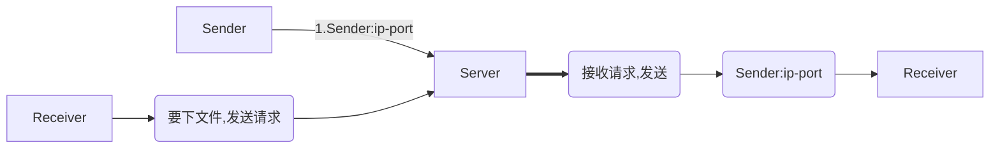

# Qtcptransfile



然后 Receiver 带着 Sender:ip-port 去找 Sender 最后建立通讯

那么 Sender 需要设立 `QTcpServer`

## CMakeList 需包含

```cmake

find_package(QT NAMES Qt6 Qt5 REQUIRED COMPONENTS Widgets Network)
find_package(Qt${QT_VERSION_MAJOR} REQUIRED COMPONENTS Widgets Network)

target_link_libraries(TcpTest PRIVATE Qt${QT_VERSION_MAJOR}::Widgets Qt${QT_VERSION_MAJOR}::Network)
```


## 封装函数说明

### clientfiletrans类


#### 调用析构：释放线程，断开连接释放 socket（最好自动调用吧）


#### 接口

| 函数名                                                       | 功能                        |
| ------------------------------------------------------------ | --------------------------- |
| `explicit ClientFileTrans(QString ip, quint16 port, QObject *parent = nullptr)` | 构造：须传入客户端的ip,port |
| `void startTrans(const QString &fileHash, const QString &savePath) 参数:文件哈希值, 存储路径` | 开始文件传输                |
| `void cancelTrans()`                                         | 取消文件传输                |
| `int getProgressValue() const`                               | 获取当前传输进度值          |


### serverfiletrans 类


#### 调用析构：断开连接释放线程（最好自动调用吧）


#### 接口

| 函数名                                                       | 功能                        |
| ------------------------------------------------------------ | --------------------------- |
| `explicit ServerFileTrans(QString ip, quint16 port, QObject *parent = nullptr)` | 构造：须传入服务器的ip,port |
| `void listen(const QString &address, quint16 port) [Signal]` | 发送开始监听信号 |
| `void dislisten() [Signal]`             | 发送断开监听信号        |


