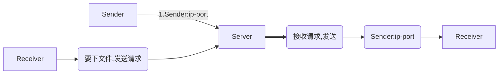

# Qtcptransfile

然后 Receiver 带着 Sender:ip-port 去找 Sender 最后建立通讯

那么 Sender 需要设立 `QTcpServer`

## 传输协议

​    帧结构：帧头4+帧长2+帧类型1+帧数据N+帧尾2（没有校验段，懒得写）

​    帧头：4字节定值 0x0F 0xF0 0x00 0xFF

​    帧长：2字节数据段长度值 arr[4]*0x100+arr[5] 前面为高位后面为低位

​    帧类型：1字节

   - 0x01 交流阶段，

     S->R:后跟四字节文件长度，长度计算同帧长一样前面为高位后面为低位

     R->S:后跟N字节文件 Url, 长度计算同帧长一样前面为高位后面为低位

        - 0x02 发送者发送文件数据，接收者准备好接收数据

        - 0x03 发送结束

        - 0x04 取消发送

​    （服务端收到0x01 0x03开始和结束发送两个命令要进行应答，回同样的命令码无数据段）

​    帧尾：2字节定值 0x0D 0x0A

7(帧头4+帧长2+帧类型1) + data + 2(tail)

### 接收数据端处理数据段：

​	接收到的帧类型：

- 0x01: 前4位是文件名长度，后面数据段为文件名 [创建相应文件并打开]

  ​		且需要发送应答(0x01, QByteArray())

- 0x02: 全为传输文件数据

- 0x03: [关闭相应文件指针],发送应答

  `(0x03, QByteArray(1, (char)((receiveSize == fileSize) ? 0x01 : 0x00)))`

- 0x04: 客户端取消发送.

### 实现 1 对多传文件（Sender端多线程）

现在已经测试过 1 对 2 传输，但是析构还有问题，造成内存泄漏程序崩溃。

解决：需要把 `timer` `stop`并且删除, 不是很清楚最开始的那个 demo 为什么能够不 `stop` 和删除。

问题：没做检测文件是否存在,如果存在报错是：

创建文件失败，无法进行接收 + url

可能需要客户端一次就开一个接收文件的连接,如果开启多个窗口,重复传的情况如下:

有时候又不会, 但是会重复传

### Todo 实现同时传多个文件（Receiver端多线程）

## 文件说明

`ClientOperate` 是客户端(接收端)的事务处理

`ClientWidget` 就是客户端(接收端)对应的 widget

`ClientOperate` 是服务器(发送端)的事务处理

`ClientWidget` 就是服务器(发送端)对应的 widget

`tcptest` 没用

`socketthread` 是多线程重写事务处理需要用到的类,继承 `QRunnable` 可以重写,最后直接放进线程池 `QThreadPool`

`clientfiletrans` 是对客户端的封装

`serverfiletrans` 是对服务器的封装

## 封装函数说明

### clientfiletrans类

#### 调用析构：释放线程，断开连接释放 socket（最好自动调用吧）

#### 接口：

| 函数名                                                       | 功能                        |
| ------------------------------------------------------------ | --------------------------- |
| `explicit ClientFileTrans(QString ip, quint16 port, QObject *parent = nullptr)` | 构造：须传入客户端的ip,port |
| `void startTrans(const QString &fileHash, const QString &savePath) 参数:文件哈希值, 存储路径` | 开始文件传输                |
| `void cancelTrans()`                                         | 取消文件传输                |
| `int getProgressValue() const`                               | 获取当前传输进度值          |

#### 

### serverfiletrans 类

#### 调用析构：断开连接释放线程（最好自动调用吧）

#### 接口：

| 函数名                                                       | 功能                        |
| ------------------------------------------------------------ | --------------------------- |
| `explicit ServerFileTrans(QString ip, quint16 port, QObject *parent = nullptr)` | 构造：须传入服务器的ip,port |
| `void listen(const QString &address, quint16 port) [Signal]` | 发送开始监听信号 |
| `void dislisten() [Signal]`             | 发送断开监听信号        |

## Operate 函数说明

### Server

#### Slot

| 函数名                                                       | 功能           |
| ------------------------------------------------------------ | -------------- |
| void ServerOperate::doListen(const QString &address, quint16 port) [slot] | 启动服务器连接 |
| void ServerOperate::dislisten() [slot]                       | 下线服务器连接 |

#### Signal

| 函数名                                                       | 功能           |
| ------------------------------------------------------------ | -------------- |
| void ServerOperate::logMessage(const QString &msg) [signal]  | 发送调试信息   |
| void ServerOperate::progressChanged(int value) [signal]      | 传递所有进度值 |
| void ServerOperate::listenStateChanged(bool isConnect) [signal] | 传递监听状态   |

### Client

#### Slot

| 函数名                                                       | 功能                 |
| ------------------------------------------------------------ | -------------------- |
| void ClientOperate::connectTcp(const QString &address, quint16 port) [slot] | 启动客户端连接       |
| void ClientOperate::disconnectTcp() [slot]                   | 下线客户端连接       |
| void ClientOperate::setFilePath(const QString &path) [slot]  | 选择所需文件存储位置 |
| void ClientOperate::setSavePath(const QString &path) [slot]  | 选择本机存储位置     |
| bool ClientOperate::startFileTransfer() [slot]               | 开始接收文件         |
| void ClientOperate::cancelFileTransfer() [slot]              | 客户端取消文件发送   |

#### Signal

| 函数名                                     | 功能               |
| ------------------------------------------ | ------------------ |
| void ClientOperate::logMessage(const QString &msg) [signal]  | 发送调试信息         |
| void ClientOperate::progressChanged(int value) [signal]      | 传递进度值           |
| void ClientOperate::connectStateChanged(bool isConnect) [signal] | 传递监听状态         |